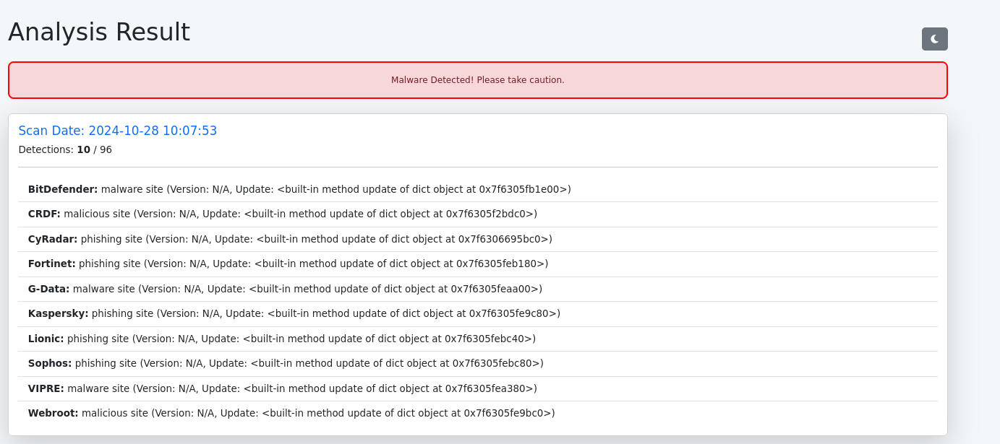
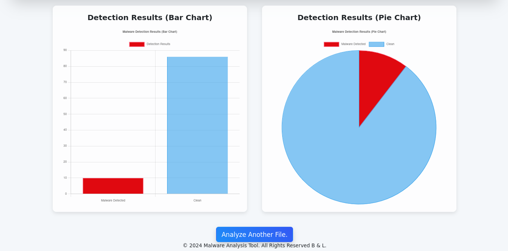
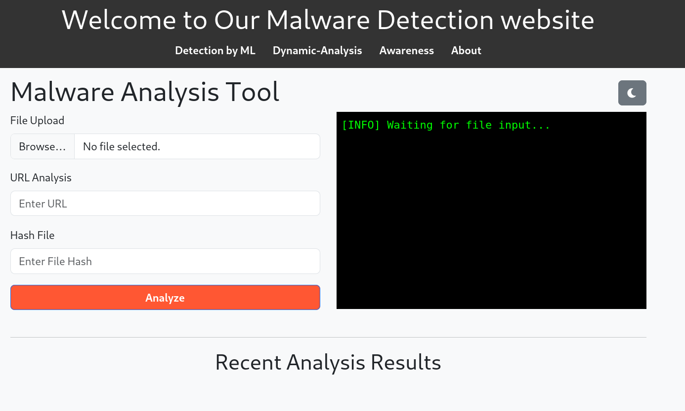
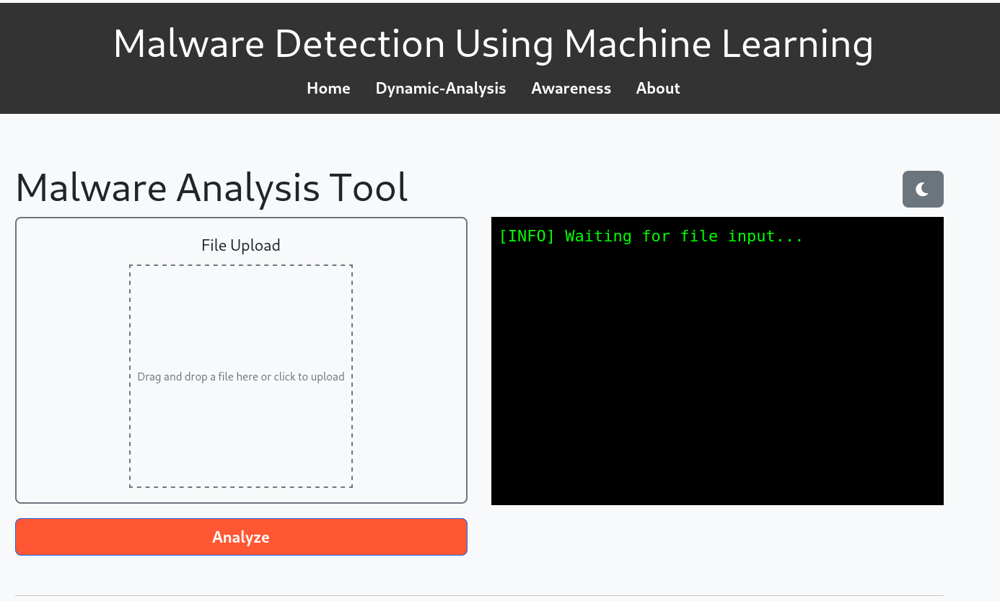
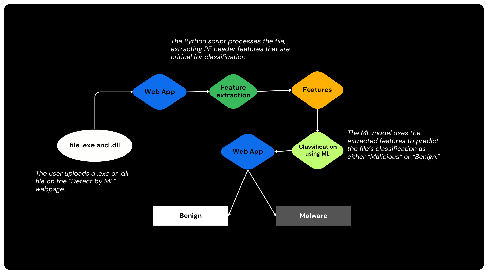
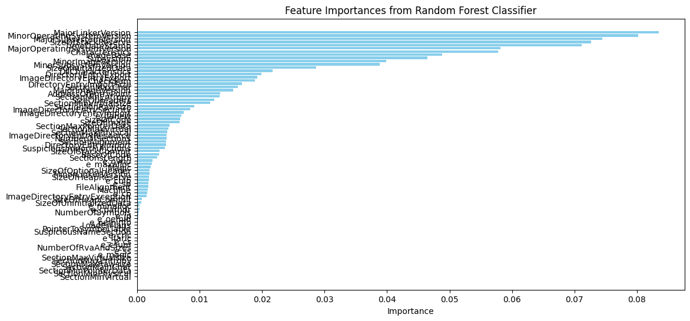
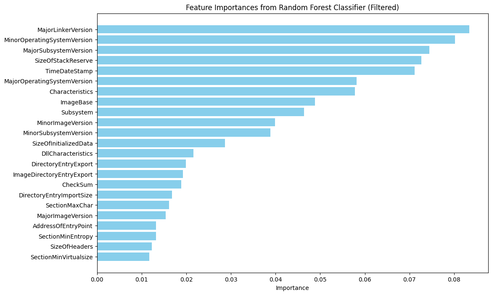
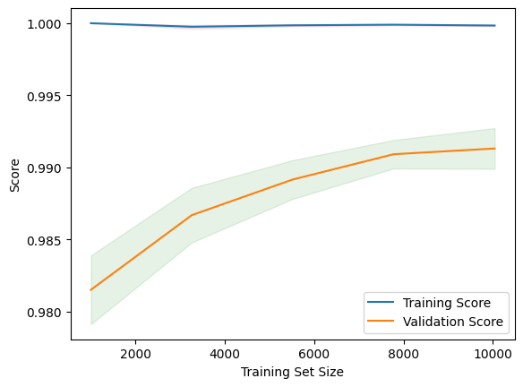
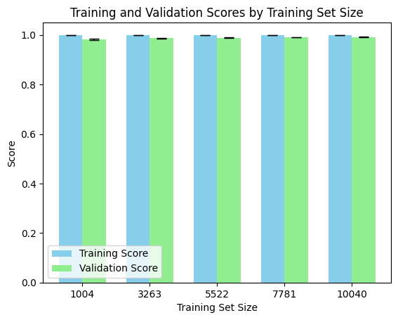

# Malware Detection and Analysis using Machine Learning

Malware Detection and Analysis using Machine Learning WebApp is a robust tool designed to provide users with an intuitive interface for analyzing and detecting malware in various file formats. This web app leverages both static analysis through the API and advanced machine learning techniques to ensure comprehensive threat assessment. MDAML is created to address the need for an accessible and user-friendly platform that enables efficient malware analysis for files, URLs, and executables.

## Table of Contents
- [Static Analysis using API](#static-analysis-using-api)
- [Machine Learning-Based Detection](#machine-learning-based-detection)
- [Installation Process](#installation-process)
- [Contributing](#contributing)


# Static Analysis using API
- [Static Analysis using API](#static-analysis-using-api)
- [Technologies Used by Static](#technologies-used-by-static)
- [File Types Supported by Static](#file-types-supported-by-static)
- [DEMO Static](#demo-static)


## Static Analysis using API

The **Static Analysis using API** component provides a fast and effective way to analyze files, URLs, and hashes by leveraging the VirusTotal API. This feature allows users to submit files or URLs and receive detailed threat intelligence, enhancing their ability to quickly identify potential security risks.

---

### Technologies Used by Static

This module uses the following technologies:

- **Flask**
- **VirusTotal API**
- **Python**
- **requests**

---

### File Types Supported by Static

The tool supports the following file types for static analysis:

- **Files**: all
- **Other supported formats**: File hashs and URLs compatible with VirusTotal API

---

### DEMO Static

Below is a quick walkthrough demonstrating the **Static Analysis using API** feature in action.

**Upload Page**  
  
*Description: A user selects a file from their local directory for analysis.*

**Result Page**  


*Description: Analysis results showing threat intelligence based on VirusTotal’s database.*

> **Video Demo**  
> For a more detailed demonstration, watch the video below:  
> [](https://youtu.be/QN3fpPI5HrU)

---

### How It Works

1. **User Input**: The user uploads a file or provides a URL for analysis.
2. **VirusTotal API Integration**: The application sends the file or URL to VirusTotal's API to fetch any associated threat intelligence data.
3. **Result Display**: The retrieved information is processed and displayed on the results page, which includes:
    - **Scan Date**: Date of the last scan for the submitted file/URL.
    - **Detection Ratio**: Ratio of the VirusTotal engines that detected a threat.
    - **Detailed Results**: A breakdown of results from different scanning engines.

---

### Benefits of Static Analysis using API

- **Quick Detection**: Allows immediate scanning using a reliable external threat database.
- **Automated Insights**: Fetches relevant intelligence data without requiring manual lookup.
- **Comprehensive Detection**: Aggregates results from multiple sources to improve detection accuracy.

This tool integrates two key methods to detect potential threats, providing users with a comprehensive approach to assess security risks.

---

**Note**: The VirusTotal API has rate limits, so depending on usage, some requests may experience throttling or delayed responses. Refer to the [VirusTotal API documentation](https://developers.virustotal.com/) for more details on rate limits and usage policies.

---


# Machine Learning-Based Detection
- [Machine Learning-Based Detection](#machine-learning-based-detection)
- [Technologies Used by ML](#technologies-used-by-ml)
- [Feature Selection and Model Training](#feature-selection-and-model-training)
- [File Types Supported by ML](#file-types-supported-by-ml)
- [DEMO ML](#demo-ml)


## Machine Learning-Based Detection

The **Machine Learning-Based Detection** component leverages a machine learning model trained to detect malicious behavior in executable files. By focusing on feature extraction from Portable Executable (PE) headers, this tool offers an advanced, ML-powered approach to identify malware within `.exe` and `.dll` files.

---

### Technologies Used by ML

This module uses the following technologies:

- **Python**
- **Scikit-Learn**
- **Flask**
- **NumPy**
- **Pandas**
- **Matplotlib**
- **pefile**
- **Joblib**
---

### Feature Selection and Model Training

The model focuses on the most important features extracted from the PE headers of executable files. Here’s an overview of the key processes:

1. **Feature Extraction**: PE header features are extracted from each file to create the feature set.
2. **Feature Selection**: Important features are selected based on importance scores from a Random Forest Classifier. Only the most relevant features are retained to optimize model accuracy.
3. **Model Training**: A Random Forest model is trained on the filtered feature set, allowing it to distinguish between benign and malicious executables with high precision.

**Model Performance**  
| Metric         | Precision | Recall | F1-score | Accuracy |
|----------------|-----------|--------|----------|----------|
| **Benign**     | 1.00      | 0.97   | 0.98     | 1003     |
| **Malware**    | 0.99      | 1.00   | 0.99     | 2920     |
| **Overall**    | -         | -      | -        | 99%      |

---

### File Types Supported

This feature is specifically designed for the following file types:

- **Executable files**: `.exe`, `.dll`

---

### DEMO ML

Below is a visual walkthrough showing how the **Machine Learning-Based Detection** feature works.

**Upload Page**  
  
*Description: The user selects an executable file for analysis.*

**Analysis Results**  
  
*Description: Results of the ML-based detection showing whether the file is benign or malicious.*

> **Video Demo**  
> For a detailed walkthrough, watch the video below:  
> [](https://youtu.be/ETgdAF1WzU8)

---

### How It Works

1. **File Upload**: The user uploads an executable file (.exe or .dll) for ML-based analysis.
2. **Feature Extraction**: The system extracts PE header features and selects only the most important features based on prior analysis.
3. **Model Prediction**: The Random Forest model uses the extracted features to predict if the file is benign or malicious.
4. **Result Display**: The application displays the result on a user-friendly interface, including probability scores and model confidence.
   
---

### Benefits of Machine Learning-Based Detection

- **High Precision**: The model achieves high accuracy in detecting malware, minimizing false positives.
- **Automated Feature Selection**: Uses the most relevant features for analysis, improving both speed and accuracy.
- **Focused Detection**: Designed specifically for executables, ensuring optimized and reliable detection for a key threat vector.

This ML-based approach complements the static analysis, providing a comprehensive toolkit for malware detection.

---

**Note**: The accuracy and precision of the model are validated on a balanced dataset, ensuring reliable performance on new and unseen data.

---


## Feature Selection and Model Training

### Selection of Features According to Their Importances

Using a Random Forest Classifier, we evaluated the importance of different features to identify the most significant ones for malware detection. By filtering the features based on their importances, we set a threshold to select only the most relevant features for training our model. This approach enhances the model's efficiency and accuracy.
### Before Selection of Features According to Their Importances
 

### After Selection of Features According to Their Importances




### Training a New Model Based on Important Features

After selecting the important features, we trained a new model, which yielded the following classification metrics:

| Class    | Precision | Recall | F1-Score | Support |
|----------|-----------|--------|----------|---------|
| Benign   | 1.00      | 0.97   | 0.98     | 1003    |
| Malware  | 0.99      | 1.00   | 0.99     | 2920    |
| **Accuracy**     | **0.99**  |        |          | **3923**    |
| Macro Avg| 0.99      | 0.98   | 0.99     | 3923    |
| Weighted Avg| 0.99   | 0.99   | 0.99     | 3923    |

**Training Scores:**  
The average training score is approximately 99.13%.

**Validation Scores:**  
The average validation score is around 98.63%.

The results demonstrate high performance for both training and validation sets, with only a slight discrepancy of 0.51%.

### Analysis

- **No Overfitting:** The close alignment of training and validation scores indicates that the model is likely not overfitting. In cases of significant overfitting, we would expect a higher training score compared to the validation score.
  
- **Slight Underfitting Possibility:** While the validation score is marginally lower than the training score, indicating a slight potential for underfitting, the difference is minimal.

### Learning Curves

To assess the model's performance over different training set sizes, we generated learning curves. These curves help visualize how the model's accuracy evolves as more training data is added.

 

### Training and Validation Scores by Training Set Size

The bar chart below displays the average training and validation scores along with their standard deviations across various training set sizes.



---

By analyzing these scores and visualizations, we gain insight into the model's learning behavior and can make informed decisions for further improvements.

# Installation process

```
1. git clone https://github.com/0xfke/Malware-Detection-and-Analysis-using-Machine-Learning.git

2. cd ML_based_detectionn
    python -m venv newvenv
    source venv/bin/activate
    pip install -r requirements.txt

3. run both the vt app.py and the ml_based_detection --> python app.py 

This will give ml_based_detection runing on port 5001 and virus_total_based in port 5000

```

## Contributors ✨

<table>
  <tr>
    
<td align="center"><a href="https://github.com/latiko"><br /><sub><b>latiko</b></sub></a><br />💻</td>
<td align="center"><a href="https://github.com/0xfke"><br /><sub><b>0xfke</b></sub></a><br />💻</td>
   
  </tr>
</table>


## 🔮 Future Work

- [ ] **Expand Machine Learning Capabilities**
    
- [ ] **Add Additional File Type Support**

- [ ] **Integrate Dynamic Analysis**
  - [ ] Implement sandboxed environments for real-time behavioral analysis of files.
  - [ ] Capture runtime system changes and network traffic to detect suspicious behaviors.

- [ ] **Enhance the User Interface**
  - [ ] Develop a dashboard for detailed analysis results, including threat history and patterns.
  - [ ] Provide visual insights like heatmaps, trend graphs, and risk scores.
